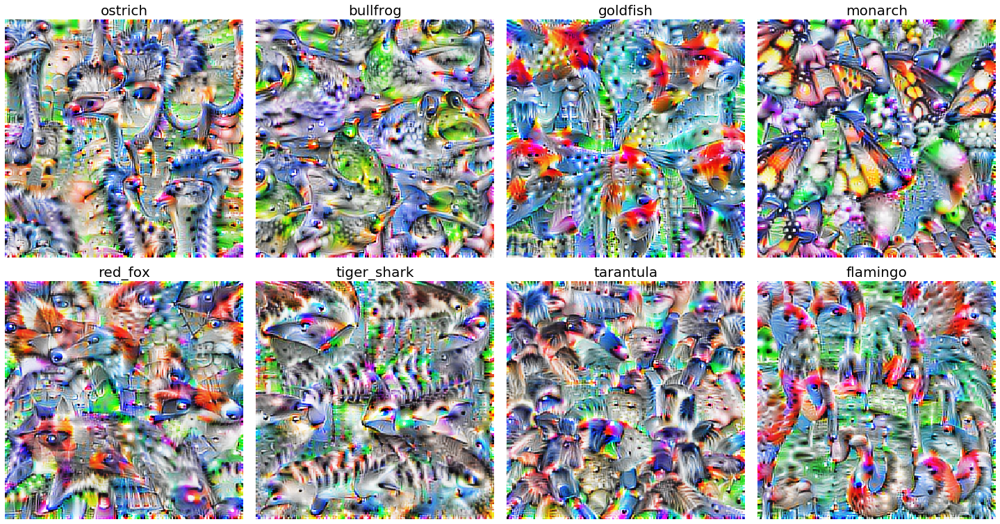
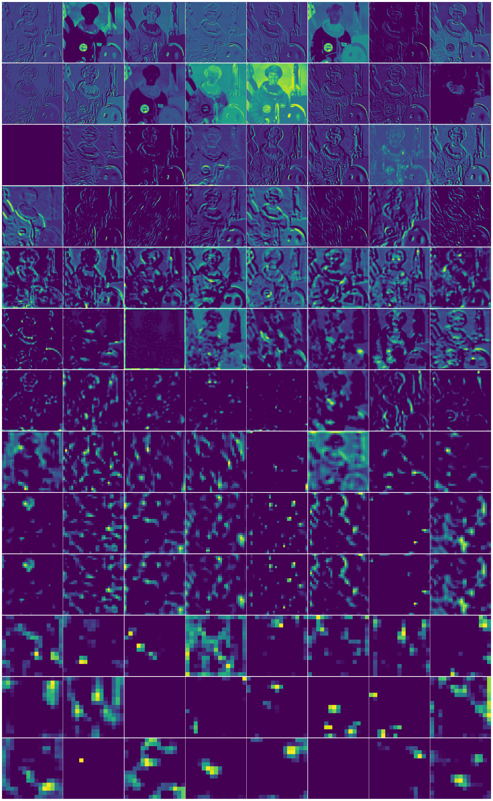
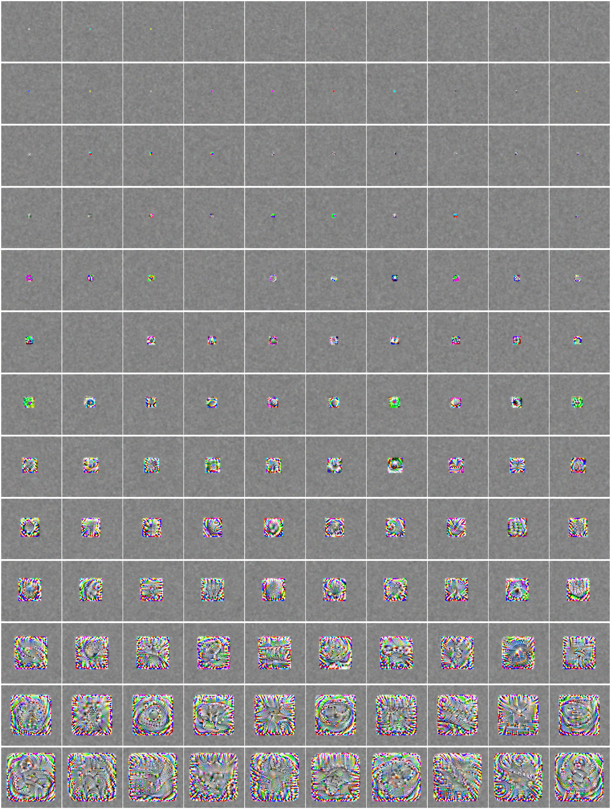
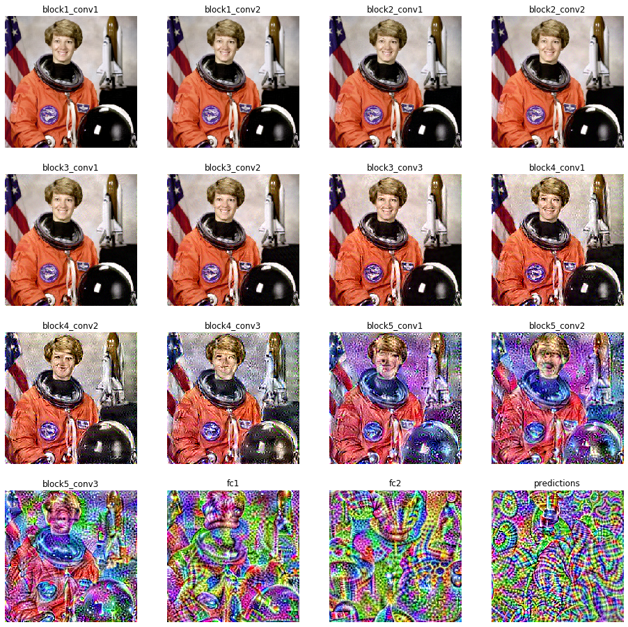
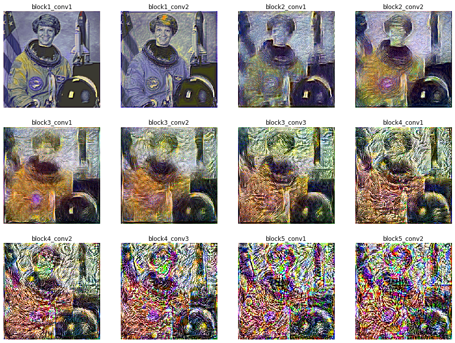

### Tensorflow 2 Deep feature visualization

These are a series of self-contained notebook that show you how to visualize classes, features, and receptive fields, and a few other things in a neural network in tensorflow. I also wrote a [short set of blog posts about this code](http://timsainburg.com). 

### Notebooks
- Visualizing classes 
- Visualizing features 
- Reconstructing images from layer activations 
- Visualizing deepdream style transfer 

### Here are a few things I implemented:

#### Class visualization

#### Feature visualization

#### Receptive field visualization

#### Image reconstruction from filter activation

#### Style transfer 

